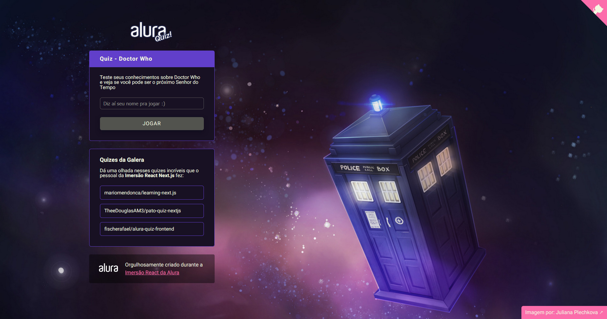

# Doctor Who Quiz

Projeto de um Quiz sobre Doctor Who desenvolvido durante a "Imersão Alura React e Next.js"

## 💻 Como iniciar o projeto 💻

 - [x] Clone o projeto. `git clone https://github.com/Emanuelpna/doctor-who-quiz.git`
 - [x] Instale as dependências. `npm install` ou `yarn`
 - [x] Altere o db.json, se quiser ou precisar
 - [x] Inicie o servidor de desenvolvimento. `npm run dev` ou `yarn dev`

## 🔮 Links úteis 🔮

Cores baseadas nesta paleta gerada no [Coolors](https://coolors.co/5e2bff-171123-fc6dab-f3fae1)

Imagem de fundo por: [Juliana Plechkova](https://www.artstation.com/artwork/yGryn)
